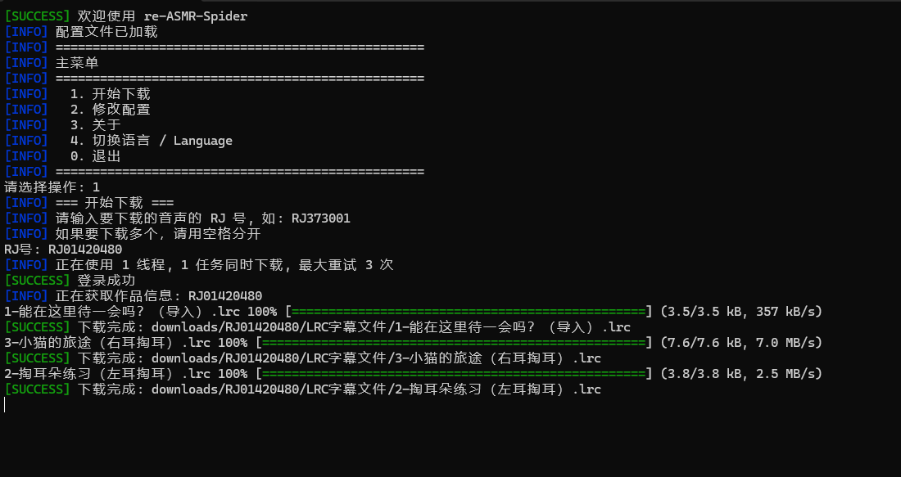
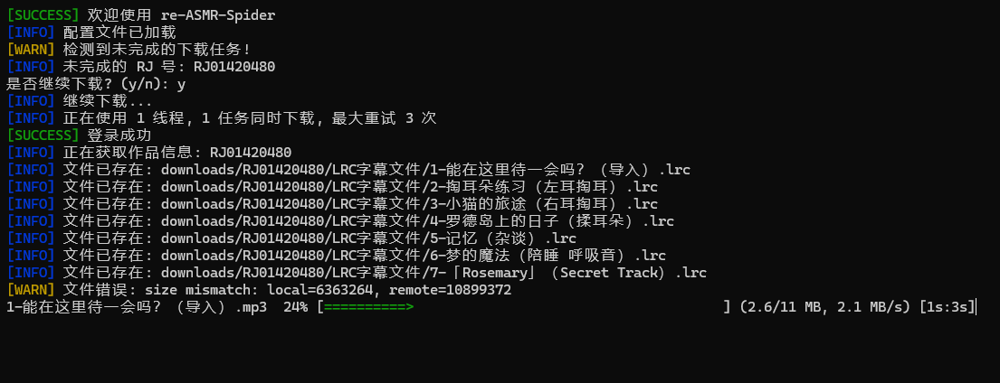
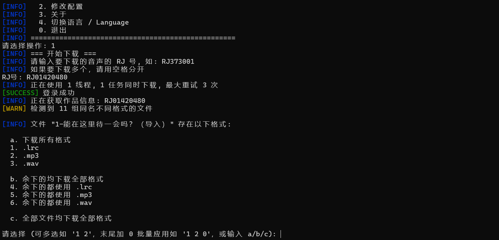

# re-ASMR-Spider

简体中文 | [繁體中文](README.zh-TW.md) | [English](../README.md) | [日本語](README.ja-JP.md)

---

一个简单高效的 ASMR 音声下载工具。

## 功能特性

- 多线程下载，支持断点续传
- 智能重试机制，自动处理网络错误
- 实时进度显示
- 文件大小校验，自动跳过已下载的内容
- 多语言支持
- 多平台支持（Windows、Linux、macOS、BSD）
- 代理配置
- 自定义筛选
- 命令行模式

## 运行截图




## 安装

### 下载预编译二进制文件

从 [Releases](https://github.com/reuAC/re-asmr-spider/releases) 页面下载最新版本。

#### 平台选择指南

| 操作系统 | CPU 架构 | 设备示例 | 下载文件 |
|---------|---------|---------|---------|
| **Windows** | | | |
| Windows 11/10/8/7 | 64位 Intel/AMD | 大多数现代 PC 和笔记本 | `Windows_x86_64.zip` |
| Windows 11/10/8/7 | 32位 Intel/AMD | 老旧 PC（2010年前） | `Windows_i386.zip` |
| Windows 11 | ARM64 | Surface Pro X、ARM 笔记本 | `Windows_arm64.zip` |
| **Linux** | | | |
| Ubuntu、Debian、Fedora、CentOS | 64位 Intel/AMD (x86_64) | 大多数服务器和桌面 | `Linux_x86_64.tar.gz` |
| Ubuntu、Debian、Fedora | 32位 Intel/AMD (i386) | 老旧32位系统 | `Linux_i386.tar.gz` |
| Raspberry Pi OS、Ubuntu | ARM64 (aarch64) | 树莓派 3/4/5（64位系统）、NVIDIA Jetson | `Linux_arm64.tar.gz` |
| Raspberry Pi OS | ARMv7 (32位) | 树莓派 2/3/4（32位系统） | `Linux_armv7.tar.gz` |
| Raspberry Pi OS | ARMv6 (32位) | 树莓派 1、Pi Zero | `Linux_armv6.tar.gz` |
| OpenWrt、LEDE | MIPS（大端） | 部分路由器（MediaTek、Atheros） | `Linux_mips.tar.gz` |
| OpenWrt、LEDE | MIPS64（大端） | 高端 MIPS 路由器 | `Linux_mips64.tar.gz` |
| OpenWrt、LEDE | MIPSle（小端） | 部分路由器（Broadcom、Realtek） | `Linux_mipsle.tar.gz` |
| OpenWrt、LEDE | MIPS64le（小端） | MIPS64 小端系统 | `Linux_mips64le.tar.gz` |
| Debian、Fedora | RISC-V 64位 | SiFive 开发板、StarFive VisionFive | `Linux_riscv64.tar.gz` |
| **macOS** | | | |
| macOS 10.13+ | Intel (x86_64) | MacBook Pro、iMac（2006-2020） | `Darwin_x86_64.tar.gz` |
| macOS 11+ | Apple Silicon (M1/M2/M3) | MacBook Air/Pro M1/M2/M3、Mac Mini M1/M2 | `Darwin_arm64.tar.gz` |
| **BSD** | | | |
| FreeBSD | 64位 Intel/AMD | FreeBSD 服务器和桌面 | `Freebsd_x86_64.tar.gz` |
| FreeBSD | 32位 Intel/AMD | 老旧 FreeBSD 系统 | `Freebsd_i386.tar.gz` |
| FreeBSD | ARM64 | FreeBSD ARM 开发板 | `Freebsd_arm64.tar.gz` |
| OpenBSD | 64位 Intel/AMD | OpenBSD 系统 | `Openbsd_x86_64.tar.gz` |
| OpenBSD | 32位 Intel/AMD | 老旧 OpenBSD 系统 | `Openbsd_i386.tar.gz` |
| OpenBSD | ARM64 | OpenBSD ARM 开发板 | `Openbsd_arm64.tar.gz` |
| NetBSD | 64位 Intel/AMD | NetBSD 系统 | `Netbsd_x86_64.tar.gz` |
| NetBSD | 32位 Intel/AMD | 老旧 NetBSD 系统 | `Netbsd_i386.tar.gz` |
| NetBSD | ARM64 | NetBSD ARM 开发板 | `Netbsd_arm64.tar.gz` |

#### 如何查看系统信息

**Windows：**
- 右键"此电脑" > 属性
- 查看"系统类型"（64位或32位，x64或ARM64）

**Linux：**
```bash
uname -m
# x86_64 -> 64位 Intel/AMD
# i386/i686 -> 32位 Intel/AMD
# aarch64 -> ARM64
# armv7l -> ARMv7
# armv6l -> ARMv6
# mips/mips64 -> MIPS
# riscv64 -> RISC-V 64位
```

**macOS：**
```bash
uname -m
# x86_64 -> Intel Mac
# arm64 -> Apple Silicon (M1/M2/M3)
```

或：Apple 菜单 > 关于本机 > 芯片（M1/M2/M3 = ARM64，Intel = x86_64）

### 从源码构建

```bash
git clone https://github.com/reuAC/re-asmr-spider.git
cd re-asmr-spider
go build -o re-asmr-spider
```

## 使用方法

### 交互模式

运行可执行文件，将自动创建默认配置文件 `config.json`。

```bash
./re-asmr-spider
```

1. 选择选项 `1. 开始下载`
2. 输入 RJ 号（例如：`RJ373001`）
3. 多个下载时，用空格分隔 RJ 号（例如：`RJ373001 RJ123456 RJ789012`）

下载的文件保存在 `downloads/` 目录。

### 命令行模式

用于自动化和脚本调用，无需交互式菜单直接下载：

```bash
# 下载单个 RJ 号
./re-asmr-spider -download RJ123456

# 下载多个 RJ 号
./re-asmr-spider -download RJ123456,RJ789012,RJ345678

# 使用自定义账号密码
./re-asmr-spider -download RJ123456 -account user@example.com -password mypass

# 配置下载参数
./re-asmr-spider -download RJ123456 -max-task 5 -max-thread 16 -buffer-size 16

# 使用代理
./re-asmr-spider -download RJ123456 -proxy http://127.0.0.1:7890

# 使用自定义配置文件
./re-asmr-spider -config /path/to/config.json -download RJ123456

# 下载优先级
# 当出现有关 flac 的冲突时，仅下载flac
# 比如同时存在 flac wav mp3 ogg 四个格式的同名文件，则仅下载flac。
# 但若没有 flac，则会下载wav。都没有时则会下载 mp3 与 ogg 
./re-asmr-spider -download RJ123456 -format-priority flac,wav

# 优先下载 flac，并额外下载 lrc 字幕文件
./re-asmr-spider -download RJ123456 -format-priority flac,wav -include-formats lrc
```

**命令行选项：**

```
-download string      要下载的 RJ 号（逗号分隔）
-config string        配置文件路径（默认: config.json）
-account string       ASMR.one 账号用户名（覆盖配置文件）
-password string      ASMR.one 账号密码（覆盖配置文件）
-max-task int         最大并发下载任务数
-max-thread int       单文件下载线程数
-max-retry int        失败下载的最大重试次数
-buffer-size int      缓冲区大小（MB），范围 1-64，默认 8
-proxy string         HTTP/HTTPS 代理（例如：http://127.0.0.1:7890）
-format-priority string
                      格式优先级，用于解决冲突的同名文件，减少下载量，逗号分隔（例如：flac,wav,mp3）
                      当同名文件存在多种格式时，只下载优先级最高的格式
                      （交互模式会逐个询问用户选择）
-include-formats string
                      额外下载的扩展名，逗号分隔（例如：lrc,jpg）
                      在上述冲突解决后，额外下载所有指定扩展名的文件
                      可与 -format-priority 配合使用
-version              显示版本信息
-help                 显示帮助信息
```

### 配置

编辑 `config.json` 或使用内置配置菜单（选项2）：

```json
{
  "account": "你的用户名",
  "password": "你的密码",
  "max_task": 3,
  "max_thread": 8,
  "max_retry": 3,
  "language": "zh-CN",
  "proxy": "",
  "buffer_size_mb": 8
}
```

**配置选项：**

- `account` - ASMR.one 账号用户名
- `password` - ASMR.one 账号密码
- `max_task` - 最大并发下载任务数
- `max_thread` - 单文件下载线程数
- `max_retry` - 失败下载的最大重试次数
- `language` - 界面语言（见下方支持的语言列表）
- `proxy` - HTTP/HTTPS 代理（例如：`http://127.0.0.1:7890`，留空则禁用）
- `buffer_size_mb` - 下载缓冲区大小（MB），范围 1-64，默认 8，针对 VPS 优化

### 格式筛选

下载音声作品时，可能会遇到同名不同格式的文件（如 `.wav`、`.flac`、`.mp3`）。程序提供智能格式筛选功能：

**交互模式：**
- 自动检测格式冲突
- 逐个提示用户选择要下载的格式
- 选项包括：
  - 下载所有格式
  - 选择特定格式
  - 将选择应用到所有剩余的同类文件（批量模式）
  - 为所有剩余文件下载所有格式
- 格式选择会被保存，下载中断后可继续使用

### 恢复下载

如果下载被中断，程序会在下次运行时检测到未完成的任务并提示您继续。您的格式选择偏好将被保留。

## 支持的语言

- 简体中文
- 繁體中文
- English
- 日本語

通过配置菜单（选项4）或编辑 `config.json` 切换语言。

## 数据来源

所有音声内容来源于 [asmr.one](https://asmr.one)。

## 许可证

MIT License

## 鸣谢

基于 DiheChen 的 [go-asmr-spider](https://github.com/DiheChen/go-asmr-spider) 开发。

## 免责声明

本工具仅供个人使用。请尊重内容创作者并通过官方渠道支持他们。
